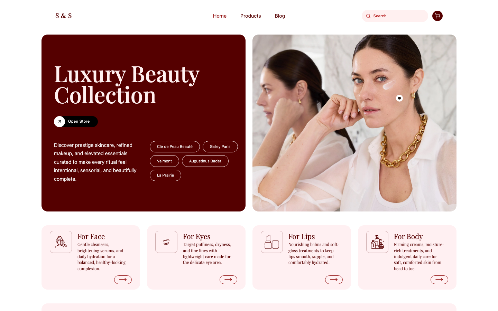

# Skin & Silk

Skin & Silk is a luxury beauty storefront built with React, TypeScript, Tailwind CSS, Redux Toolkit, and React Router. It combines a curated home page, responsive product browsing, detailed product pages, cart and order flows, and an editorial blog experience inside a polished boutique-style UI.

<p align="center">
  
</p>

## Performance

| Metric | Score |
|---|---|
| Performance | 99 |
| Accessibility | 95 |
| Best Practices | 100 |
| SEO | 100 |

## Overview

The app is designed as a premium beauty shopping experience with:

- a visually led home page
- a filterable and sortable product list
- responsive product detail pages with gallery, pricing, and related products
- cart state persisted to local storage
- order creation and order detail flows
- a blog landing page and full article pages

Product data is currently served from local mock JSON and hydrated into app-ready product models, which makes the project easy to run locally without a backend.

## Tech Stack

- React 18
- TypeScript
- Vite
- Tailwind CSS
- Redux Toolkit
- React Router
- Storybook

## Features

- Luxury storefront UI with custom editorial styling
- Responsive home, product list, product detail, blog, and blog article pages
- Category filtering and sort controls
- Search-driven product discovery
- Related products on product detail pages
- Add-to-cart interactions with toast feedback
- Cart persistence via local storage
- Order route loaders and action handling
- Storybook support for isolated UI work

## Project Structure

```text
src/
  components/
    features/      # product, cart, order, and user features
    layout/        # app shell and header
    ui/            # shared UI and page-level presentation components
  content/         # blog article content
  constants/       # routes, categories, and filter helpers
  routes/          # route loaders and actions
  services/        # mock product and order services
  store/           # Redux store and local storage middleware
  types/           # shared TypeScript types
```

## Getting Started

### Prerequisites

- Node.js 18 or newer
- npm

### Install

```bash
npm install
```

### Run the app

```bash
npm run dev
```

This starts the Vite dev server, usually at `http://localhost:5173`.

## Available Scripts

```bash
npm run dev
```

Starts the local development server.

```bash
npm run build
```

Builds the app for production.

```bash
npm run preview
```

Previews the production build locally.

```bash
npm run lint
```

Runs ESLint across the codebase.

```bash
npm run storybook
```

Runs Storybook for working on components in isolation.

```bash
npm run build-storybook
```

Builds a static Storybook output.

## Data Layer

The storefront currently uses local mock data:

- products are loaded from `src/services/mockData/products.json`
- product images are resolved dynamically in `src/services/productsService.ts`
- product detail pages use React Router loaders for route-level data fetching

This makes the app easy to prototype and extend before wiring a real API.

## Notes

- Cart state is persisted with local storage middleware.
- The UI follows a custom luxury-beauty visual direction rather than a default ecommerce template.
- The blog content is currently stored in code under `src/content/blogArticles.ts`.

## Storybook

Run Storybook locally with:

```bash
npm run storybook
```

Build a static Storybook with:

```bash
npm run build-storybook
```
